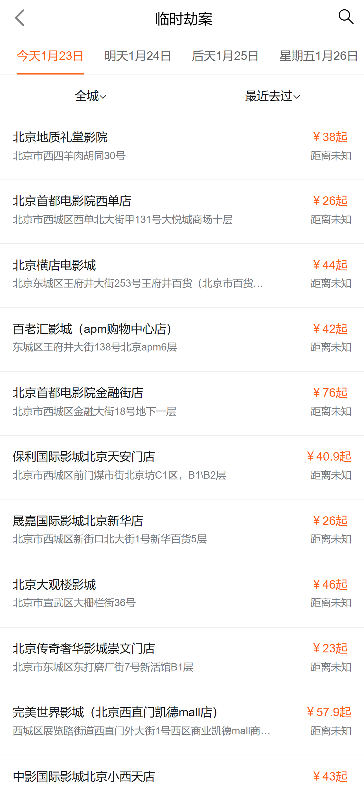
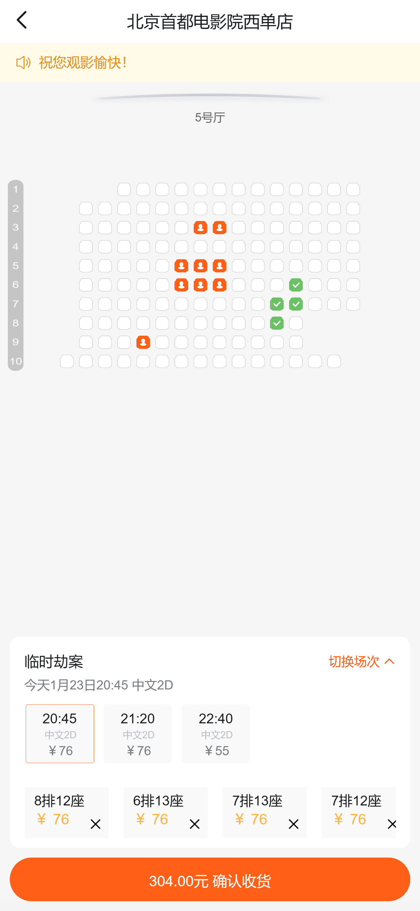

#关于项目
这是一个模仿卖座电影而创建的项目,使用vue2全家桶编写，实现了与官方网站的95%以上相似度 是我再2022年刚学完vue时编写完成 可能代码格式没有那么好看 但是我觉得里边还是有值得新手学习的地方的 如果能帮到你的话 麻烦点个star emoji:smile:

##### VUE-CLI 5.0
使用了vue-cli 5.0 构建了卖座网开发环境

##### vant
采用了vant ui组件库

##### swiper
定制了几种轮播图

##### vuex-persistedstate
使用了持久化存储

等等...

## 界面预览
</img>
</img>
</img>
</img>
</img>

## 声明
本项目的接口皆来自官方网站也仅供学习使用，请勿使用于其他用途，如因此造成的一切后果，皆与本人无关，请认准官方网站[卖座电影](https://m.maizuo.com/v5/#/films/nowPlaying)